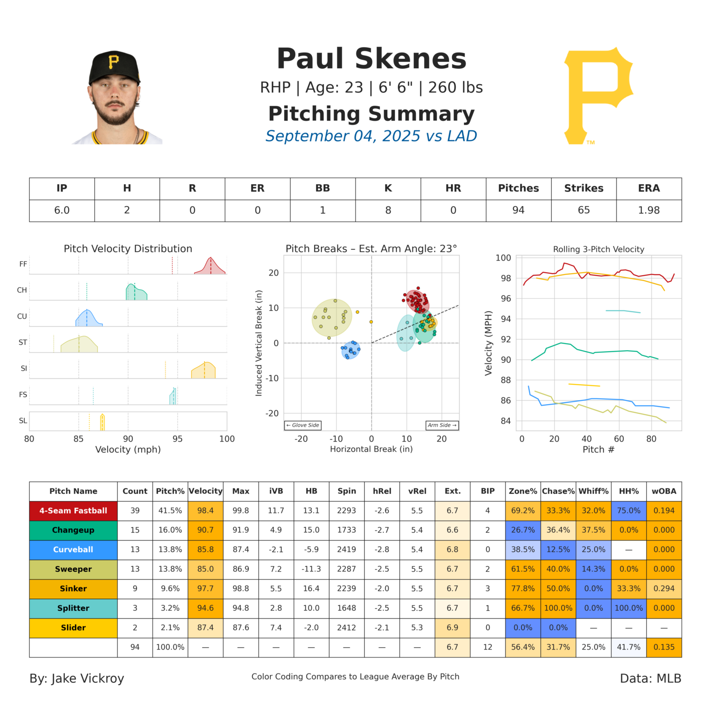

# MLB Daily Pitching Dashboard (Streamlit)

Live, per-game pitcher cards built on Statcast data. See pitch distribution, pitch shapes, rolling velocity, and a live box score line — updated during games.

## ▶️ Live App
[Open the App!](https://mlb-live-pitcher-cards.streamlit.app/)




## Features
- Live per-pitch data for the selected date & pitcher
- Pitch velocity KDEs, pitch shapes, rolling velo
- Box score line, pitch table with league-average coloring
- Manual **Refresh** button + short cache TTL for in-game updates

## Run locally
```bash
# Python 3.10+ recommended
pip install -r requirements.txt
streamlit run live_pitcher_app.py   # or app.py if you renamed it
